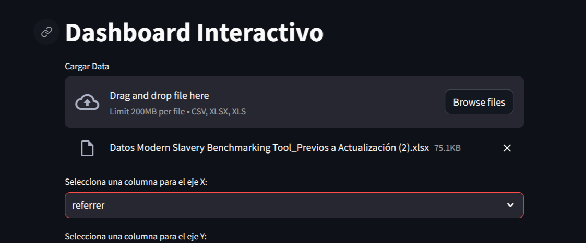
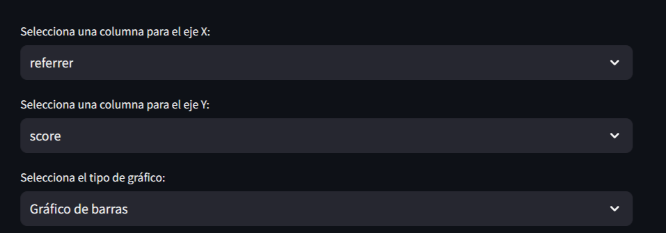
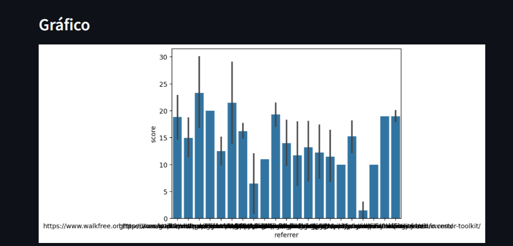
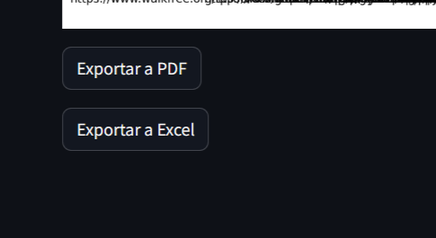

# Dashboard Interactivo

Este es un dashboard interactivo desarrollado utilizando Streamlit, una biblioteca de Python para crear aplicaciones web de manera rápida y sencilla. El objetivo de esta aplicación es permitir a los usuarios cargar sus propios conjuntos de datos y visualizarlos de diversas formas utilizando gráficos interactivos.

## ¿Cómo usar?

1. Clona este repositorio en tu máquina local.
2. Instala las dependencias necesarias. Puedes hacerlo ejecutando `pip install -r requirements.txt`.
3. Ejecuta la aplicación ejecutando `streamlit run main.py`.
4. Carga tu conjunto de datos seleccionando el botón "Cargar Data" y elige el archivo deseado.
5. Selecciona las columnas que deseas utilizar para los ejes X y Y, así como el tipo de gráfico que deseas crear.
6. Explora los datos utilizando los gráficos interactivos disponibles.
7. Exporta los gráficos a PDF o los datos a Excel utilizando los botones correspondientes.

## Capturas de pantalla

## Contribución

¡Las contribuciones son bienvenidas! Si deseas mejorar esta aplicación, simplemente haz un fork de este repositorio, realiza tus cambios y envía un pull request.

## Autor

[Nombre del autor]

## Licencia

Este proyecto está bajo la [Licencia MIT](LICENSE).
